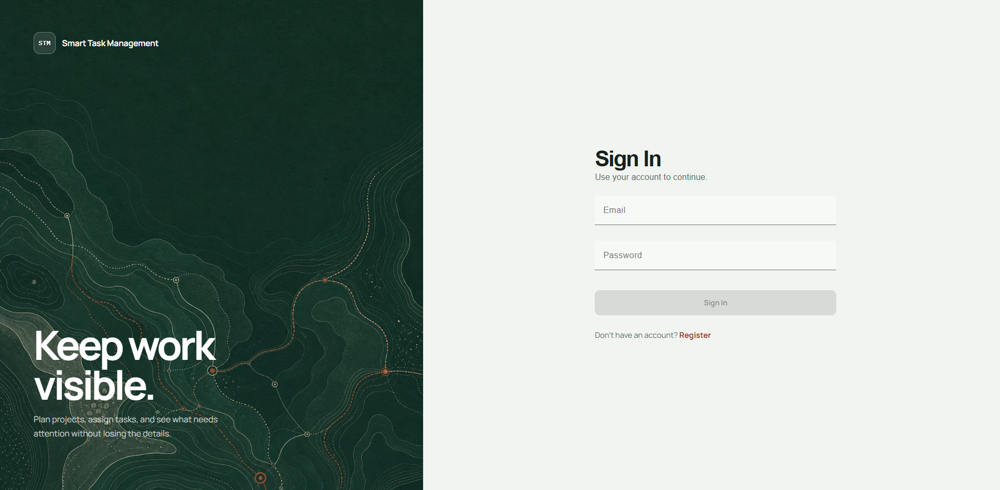
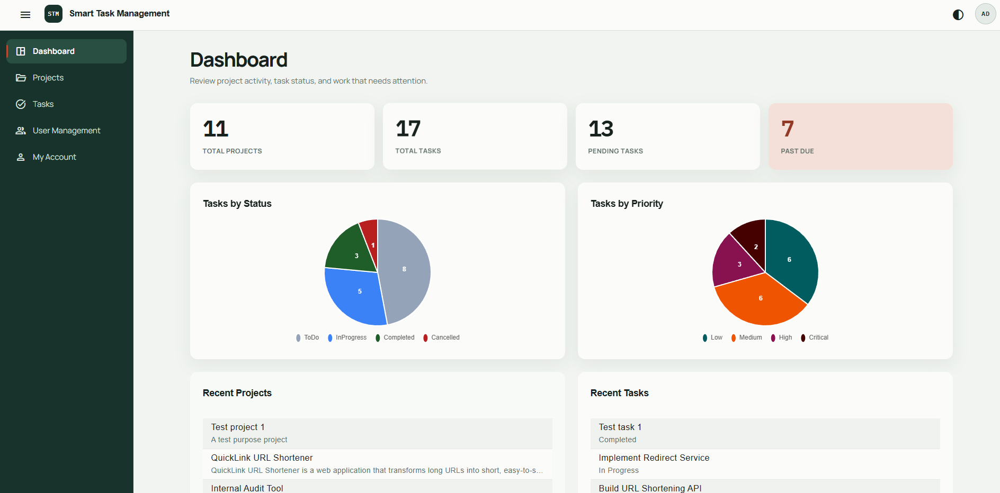
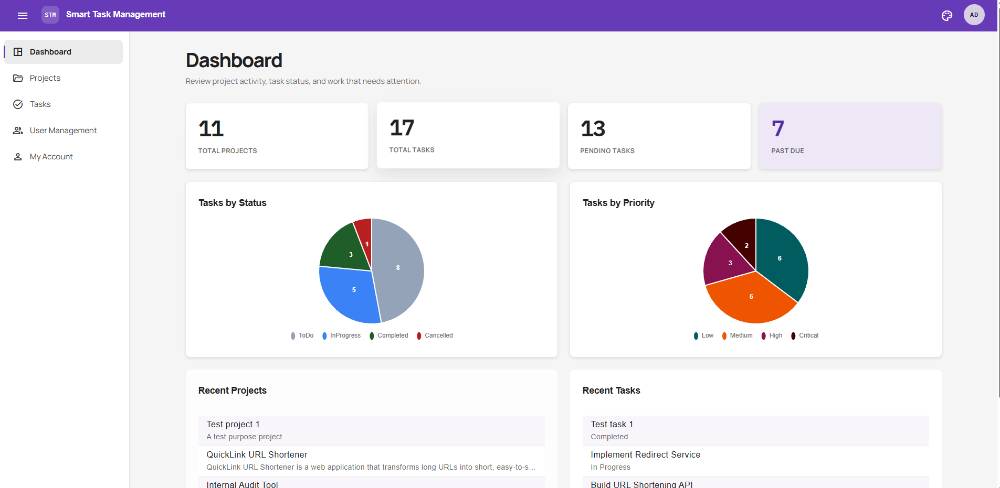
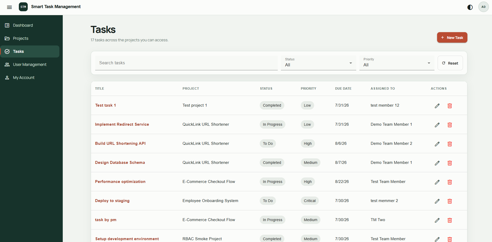
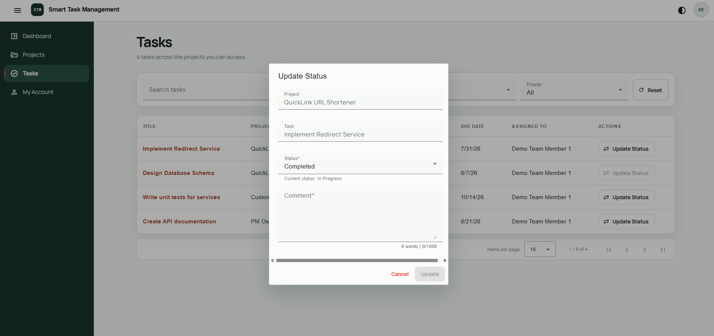
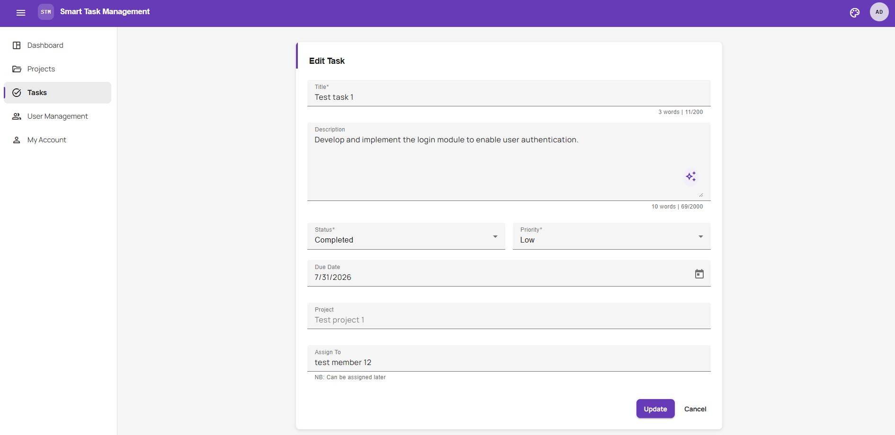
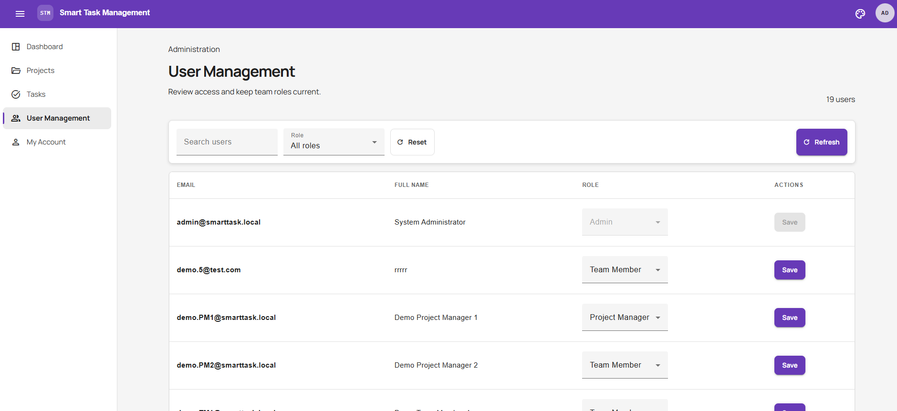

# Smart Task Management System

Smart Task Management System is a full-stack task and project management application built with ASP.NET Core 9 and Angular 21+. It enables teams to manage projects, assign and track tasks, and control access through role-based permissions.

## Features

- JWT Authentication with Refresh Tokens
- Role-Based Access Control (Admin, Project Manager, Team Member)
- Permission-Based Authorization
- Project Management
- Task Management
- Local-time timestamp display: UTC timestamps are stored by the backend and rendered in each user's browser timezone in the Angular frontend; calendar due dates remain date-only.
- User Management
- Self-service password changes with current-password verification and refresh-session revocation
- Search, Filtering, Sorting & Pagination
- Dashboard Reporting & Statistics
- AI-Assisted Task Description Improvement
- Dual-theme support: switch between **Field-Ledger** (default, dark-green auth brand) and **Classic** (deep-purple Material palette) via a toolbar toggle; preference persists in `localStorage`.
- Soft Delete
- Real-time word & character count on form fields (project name/description, task title/description, change-status comment) via a reusable `TextCounterPipe`, displayed inline below each input in a dimmed style.

## App Preview

The application brings its main workflows into one responsive workspace:

- **Role-aware workspaces:** Admins manage the full system, Project Managers manage their own projects, and Team Members focus on assigned work.
- **Project and task tracking:** Search, filter, sort, paginate, assign work, set priorities and due dates, and monitor progress from the dashboard.
- **Audited status workflow:** Assigned Team Members move tasks forward with a required comment, while authorized users can review immutable status history.
- **AI-assisted task writing:** Improve task descriptions directly in the task form, with reusable live word and character counters.
- **Dual themes:** Switch between the default **Field-Ledger** theme and the **Classic** Angular Material theme; the saved preference is restored on the next visit.

### Sign in



### Dashboard and dual-theme support

The dashboard summarizes projects, tasks, overdue work, status, and priority. The same workspace can be viewed in either theme.

<table>
  <tr>
    <th>Field-Ledger (default)</th>
    <th>Classic</th>
  </tr>
  <tr>
    <td></td>
    <td></td>
  </tr>
</table>

### Task management and status workflow

Task lists combine search, status and priority filters, assignments, due dates, pagination, and role-specific actions.



Assigned Team Members use a forward-only status dialog with a required audit comment; terminal tasks cannot be advanced again.



### AI-assisted task form

The task form includes live text counters and an AI action for improving the description when an AI provider is configured.



### User and role management

Admins can search users, filter by role, and update role assignments from a dedicated administration screen.



## Technology Stack

| Layer | Technology |
|-------|------------|
| API / host | ASP.NET Core 9 |
| Application | .NET 9 class library (business rules, DTOs, service abstractions) |
| Domain | .NET 9 class library (entities, enums) |
| Persistence | EF Core 9 + SQL Server (LocalDB for local dev) |
| Identity & auth | ASP.NET Core Identity, JWT bearer, refresh tokens |
| Validation | FluentValidation |
| Logging | Serilog (console + rolling file) |
| API docs | Swashbuckle / Swagger (Development only) |
| Frontend | Angular 21+, Angular Material 21, standalone components, signals, signal-based state |

**New frontend dependencies:** `@fontsource-variable/manrope` (variable font for UI), `@fontsource/ibm-plex-mono` (monospace for data/code), `material-symbols` (Material Symbols icon font replacing Font Awesome), `ng2-charts` + `chart.js` + `chartjs-plugin-datalabels` (dashboard pie charts).

## Folder Structure

```
SmartTaskManagement/
├─ SmartTaskManagement.sln
├─ README.md
├─ SmartTaskManagement.Domain/          # entities, enums (depends on nothing)
│  └─ Entities/                         # RefreshToken, Project, TaskItem, status/priority enums
├─ SmartTaskManagement.Application/     # business rules, DTOs, abstractions → Domain
│  ├─ Abstractions/                     # IProjectRepository, ITaskRepository, IIdentityService,
│  │                                    #   IJwtTokenGenerator, IRefreshTokenService, ICurrentUserService
│  ├─ Authentication/                   # auth DTOs, validators, AuthService
│  ├─ Authorization/                    # RoleNames, permissions
│  ├─ Users/                            # user lookup DTOs, user management DTOs, validators
│  ├─ Projects/                         # DTOs, validators, ProjectService
│  ├─ Tasks/                            # DTOs, validators, TaskService
│  ├─ Dashboard/                        # DashboardService, DashboardResponse
│  └─ Common/                           # Result / ErrorType / PagedResult / SortDirection
├─ SmartTaskManagement.Infrastructure/  # EF Core, DbContext, migrations → Application/Domain
│  ├─ Identity/                         # ApplicationUser/Role, IdentityDataSeeder, IdentityService
│  ├─ Authentication/                   # JwtTokenGenerator, RefreshTokenService, JwtOptions
│  ├─ Persistence/                      # ApplicationDbContext, repositories, EF configurations
│  ├─ Ai/                               # GeminiTaskAiService, AiPrompts, AiStatusService
│  ├─ Migrations/
│  └─ DependencyInjection.cs            # AddInfrastructure(IConfiguration)
├─ SmartTaskManagement.API/             # ASP.NET Core host → Application/Infrastructure
│  ├─ Authentication/                   # CurrentUserService
│  ├─ Controllers/                      # AuthController, ProjectsController, TasksController, DashboardController, AiController, UsersController
│  ├─ Common/                           # ApiResponse envelope, Result→ActionResult mapping
│  ├─ Extensions/                       # focused DI/pipeline composition
│  ├─ Filters/ValidationActionFilter.cs # model validation → consistent error envelope
│  ├─ Middleware/ExceptionHandlingMiddleware.cs
│  └─ Program.cs                        # composition root
├─ client/smart-task-ui/                # Angular 21+ frontend
│  ├─ public/                           # static assets (favicon, theme-init.js, auth-workstream.webp)
│  │  ├─ theme-init.js                   # sets initial theme from localStorage before Angular loads (FOUC prevention)
│  │  └─ auth-workstream.webp            # hero background image for the auth page brand panel
│  └─ src/
│     ├─ index.html                      # loads theme-init.js script; no external font/icon CDN
│     ├─ styles.css                      # global styles; defines CSS variables for both themes (field-ledger + classic)
│     │                                  # and Material theming overrides
│     │  ├─ app/
│     │  │  ├─ app.config.ts                # registers ThemeService app-initializer for theme init
│     │  │  ├─ app.routes.ts
│     │  │  ├─ app.ts
│     │  │  ├─ app.html
│     │  ├─ core/                        # auth, guards, interceptors, services, models
│     │  │  ├─ interceptors/             # auth.interceptor.ts, error.interceptor.ts
│     │  │  ├─ auth/                     # auth.service.ts, token-storage.service.ts
│     │  │  ├─ services/                 # theme.service.ts, ai.service.ts, api.service.ts, notification.service.ts
│     │  │  ├─ models/                   # AuthResponse, ApiResponse, enums
│     │  │  ├─ guards/                   # authGuard, roleGuard, unsavedChangesGuard
│     │  │  └── validators/
│     │  ├─ layouts/shell/              # sidenav, toolbar (with theme toggle), shell
│     │  ├─ features/                   # dashboard, projects, tasks, auth, account, users
│     │  │  └─ auth/
│     │  │     ├─ auth-shared.css       # shared auth page styles (grid layout, brand panel, theme-aware)
│     │  │     ├─ login/
│     │  │     └─ register/
│     │  ├─ error/                      # 403, 404 page components
│     │  └─ shared/                     # components (ai-enhance-button), constants, pipes
│     └─ styles.css                      # global styles; defines CSS variables for both themes (field-ledger + classic)
```

**Dependency direction:** `API → Application → Domain` and `Infrastructure → Application/Domain`.
Inner layers never reference outer layers.

## Prerequisites

- .NET 9 SDK
- SQL Server LocalDB (`(localdb)\MSSQLLocalDB`) — or adjust the connection string for your server
- EF Core tools: `dotnet tool install --global dotnet-ef`
- Node.js 18+ and npm (for the Angular frontend)

## Setup

1. **Restore & build backend**
   ```bash
   dotnet build
   ```

2. **Configure secrets** (never committed). For local development you can use .NET User Secrets;
   for production use environment variables. The connection string, the JWT signing key, the seeded
   admin password, and the AI API key all live here:
   ```bash
   dotnet user-secrets set "ConnectionStrings:SmartTaskConnection" "Server=(localdb)\MSSQLLocalDB;Database=SmartTaskManagementDb;Trusted_Connection=True;MultipleActiveResultSets=true;TrustServerCertificate=True" --project SmartTaskManagement.API

   # 64-byte (base64) random key used to sign JWTs
   dotnet user-secrets set "Jwt:SigningKey" "<base64-encoded-random-key>" --project SmartTaskManagement.API

   # password for the seeded admin user (email is admin@smarttask.local)
   # If this secret is not set, no admin user is created.
   dotnet user-secrets set "Seed:AdminPassword" "<strong-password>" --project SmartTaskManagement.API

   # AI provider API key (optional; enables POST /api/tasks/improve-description)
   dotnet user-secrets set "Ai:ApiKey" "<your-api-key>" --project SmartTaskManagement.API
   ```
   > The connection-string key is `SmartTaskConnection` (not `DefaultConnection`) to avoid
   > colliding with an unrelated machine-level environment variable. `appsettings.json`
   > intentionally holds no secrets — only non-secret config (`Jwt` issuer/audience/lifetimes,
   > `Cors`, `Serilog`, `Seed:AdminEmail`, `Ai` provider/model/timeout/header).
   >
   > **Production:** set these values as environment variables on the host instead of User Secrets.
   > ASP.NET Core reads `ConnectionStrings:SmartTaskConnection`, `Jwt:SigningKey`,
   > `Seed:AdminPassword`, and `Ai:ApiKey` from the environment automatically.

3. **Apply migrations** (creates `SmartTaskManagementDb`):
   ```bash
   dotnet ef database update --project SmartTaskManagement.Infrastructure --startup-project SmartTaskManagement.API
   ```

4. **Run the API**
   ```bash
   dotnet run --project SmartTaskManagement.API
   ```
   - HTTP: `http://localhost:5193`
   - HTTPS: `https://localhost:7277`
   - Swagger UI: `https://localhost:7277/swagger` (Development only)
    - On startup the app seeds the three roles and, if `Seed:AdminPassword` is configured,
      a default admin user. If `Seed:EnableDemoUsers` is also enabled, demo users are seeded too.

5. **Run the Angular frontend** (in a separate terminal)
    ```bash
    cd client/smart-task-ui
    npm install
    npm start
    ```
    - If `npm start` fails in your environment, you can run `ng serve` directly instead.
    - The frontend calls the API directly at `https://localhost:7277` (configured in `environment.ts`).
    - Default login: `admin@smarttask.local` / the password set in User Secrets.

 6. **Demo users** (optional)
    When `Seed:EnableDemoUsers` is `true` and `Seed:AdminPassword` is configured,
    the API seeds the following demo accounts on startup with the same password:
    - `demo.PM1@smarttask.local` — Project Manager
    - `demo.PM2@smarttask.local` — Project Manager
    - `demo.TM1@smarttask.local` — Team Member
    - `demo.TM2@smarttask.local` — Team Member
    - `demo.TM3@smarttask.local` — Team Member

    > Note: `appsettings.Development.json` already sets `Seed:EnableDemoUsers` to `true`,
    > so demo users are available automatically in Development.

## Roles & Permissions

Authorization is **permission-based**. Each role is seeded with a set of `permission` claims;
those claims are carried in the JWT, and protected endpoints require a matching policy. Resource
ownership is enforced in the service layer, not in the token:
- **Admin:** full access to every project, task, and user management.
- **Project Manager:** can view, create, update, and delete only their own projects and the tasks within them.
- **Team Member:** can view only projects/tasks assigned to them, and advance assigned task status through the Team Member status workflow.

| Role | Feature permissions | Notes |
|------|--------------------|-------|
| Admin | `AdminPermissions` | Full access to every general permission and project, task, and user management. Team-Member-only status changes remain service-restricted. |
| Project Manager | projects.*, tasks.* | Can view, create, update, and delete only their own projects and the tasks within them. Cannot manage users. |
| Team Member | none | Can view only projects/tasks assigned to them, and change status on tasks assigned to them. |

Permissions in use: `projects.create`, `projects.update`, `projects.delete`, `tasks.create`,
`tasks.update`, `tasks.delete`, `tasks.assign`, `tasks.status.change`, `tasks.status-history.view`, `users.manage`. Listing and viewing are available to authenticated
users with visibility/ownership rules applied in the services. The dedicated forward-only status workflow is
restricted to assigned Team Members; Admin and Project Manager status edits remain part of task editing.

## API Overview

All responses use the `ApiResponse` / `ApiResponse<T>` envelope. Send the JWT as
`Authorization: Bearer <access token>` on authenticated endpoints.

### Auth — `api/auth`
| Endpoint | Auth | Description |
|----------|------|-------------|
| `POST /api/auth/register` | anonymous | Create a user with the default `TeamMember` role (no tokens returned). |
| `POST /api/auth/login` | anonymous | Verify credentials; return access token + refresh token. |
| `POST /api/auth/refresh` | anonymous | Rotate the refresh token; return a new token pair. |
| `POST /api/auth/logout` | authenticated | Revoke the supplied refresh token so it can no longer be exchanged. |
| `POST /api/auth/change-password` | authenticated | Change only the authenticated user's password after verifying the current password; revoke all of that user's refresh tokens. |

Refresh tokens are persisted as SHA-256 hashes, rotated on every use, and revocable on logout.

### Projects — `api/projects`
| Endpoint | Permission | Description |
|----------|-----------|-------------|
| `GET /api/projects` | authenticated | List projects with search, filtering, sorting, and pagination. Visibility: Admin sees all; Project Manager sees only their own; Team Member sees only projects containing tasks assigned to them. |
| `GET /api/projects/{id}` | authenticated | Project details. Visibility rules same as list. |
| `POST /api/projects` | `projects.create` | Create a project. |
| `PUT /api/projects/{id}` | `projects.update` | Update a project (ownership enforced). |
| `DELETE /api/projects/{id}` | `projects.delete` | Soft-delete a project; cascades soft deletion to its tasks. |

**List query parameters:** `search` (keyword), `status` (enum), `priority` (enum), `dueDate` (date only),
`assignedToUserId` (guid), `sortField` (`Title`, `DueDate`, `Priority`, `Status`, `CreatedAt`),
`sortDirection` (`Asc`, `Desc`), `pageNumber`, `pageSize`.

**List response shape:**
```json
{
  "success": true,
  "data": {
    "items": [ /* ProjectResponse[] */ ],
    "totalCount": 10,
    "pageNumber": 1,
    "pageSize": 20,
    "totalPages": 1
  }
}
```

**ProjectResponse:**
```json
{
  "id": "00000000-0000-0000-0000-000000000000",
  "name": "Project name",
  "description": "Optional description",
  "createdByUserId": "00000000-0000-0000-0000-000000000000",
  "createdByUserName": "Admin User",
  "createdAt": "2026-07-23T00:00:00Z",
  "updatedAt": "2026-07-23T00:00:00Z"
}
```

### Tasks
| Endpoint | Permission | Description |
|----------|-----------|-------------|
| `GET /api/tasks` | authenticated | Global task list with search, filtering, sorting, and pagination. Visibility: Admin sees all; Project Manager sees only tasks in their own projects; Team Member sees only tasks assigned to them. |
| `GET /api/projects/{projectId}/tasks` | authenticated | List a single project's tasks. Visibility rules same as global task list. |
| `GET /api/tasks/{id}` | authenticated | Task details. Visibility rules same as global task list. |
| `POST /api/projects/{projectId}/tasks` | `tasks.create` | Create a task in a project. |
| `PUT /api/tasks/{id}` | `tasks.update` | Update task details. |
| `DELETE /api/tasks/{id}` | `tasks.delete` | Soft-delete a task. |
| `PUT /api/tasks/{id}/assignment` | `tasks.assign` | Assign the task to a user. |
| `PUT /api/tasks/{id}/status` | `tasks.status.change` | Team Member-only status workflow; advance an assigned task from `ToDo` → `InProgress` or `InProgress` → `Completed`; requires a 1–1000 character comment. |
| `GET /api/tasks/{id}/status-history` | Admin / Project Manager | View immutable status history. Project Managers may view tasks in projects they own. |
| `POST /api/tasks/improve-description` | authenticated | Improve a task description using the AI provider. |

**Task status:** `ToDo`, `InProgress`, `Completed`, `Cancelled`.
**Task priority:** `Low`, `Medium`, `High`, `Critical`.

**Task list response shape:** same `PagedResult<T>` envelope as projects.

**TaskResponse:**
```json
{
  "id": "00000000-0000-0000-0000-000000000000",
  "projectId": "00000000-0000-0000-0000-000000000000",
  "projectName": "Project name",
  "title": "Task title",
  "description": "Optional description",
  "status": "ToDo",
  "priority": "High",
  "dueDate": "2026-07-23T00:00:00Z",
  "assignedToUserId": "00000000-0000-0000-0000-000000000000",
  "assignedToUserName": "Admin User",
  "createdAt": "2026-07-23T00:00:00Z",
  "updatedAt": "2026-07-23T00:00:00Z"
}
```

### Users — `api/users`
| Endpoint | Permission | Description |
|----------|-----------|-------------|
| `GET /api/users/assignees` | `tasks.assign` | Returns users eligible to be assigned to tasks (Team Members only). |
| `GET /api/users` | `users.manage` | Returns all users with their current role assignments. |
| `PUT /api/users/{id}/role` | `users.manage` | Replaces the role assigned to the specified user. Pass `null` or empty string to remove all roles. |

### Dashboard
| Endpoint | Permission | Description |
|----------|-----------|-------------|
| `GET /api/dashboard` | authenticated | Basic statistics: total projects, total tasks, tasks by status, tasks by priority, completed vs pending, past due tasks. |

**DashboardResponse:**
```json
{
  "totalProjects": 5,
  "totalTasks": 42,
  "tasksByStatus": { "ToDo": 10, "InProgress": 20, "Completed": 10, "Cancelled": 2 },
  "tasksByPriority": { "Low": 5, "Medium": 20, "High": 12, "Critical": 5 },
  "completedTasks": 10,
  "pendingTasks": 30,
  "pastDueTasks": 8
}
```

### AI
| Endpoint | Permission | Description |
|----------|-----------|-------------|
| `GET /api/ai/status` | anonymous | Returns whether the AI description improver is configured (`enabled`). |
| `POST /api/tasks/improve-description` | authenticated | Improve a task description. Requires `Ai:ApiKey` in User Secrets. |

**AI improve request:**
```json
{ "description": "Fix bug." }
```

**AI improve response:**
```json
{
  "improvedDescription": "Investigate, reproduce, and resolve the reported defect while adding regression coverage."
}
```

### Operational
| Endpoint | Description |
|----------|-------------|
| `GET /health` | Health check; returns an `ApiResponse` envelope with the DB check status. |
| `GET /swagger` | Swagger UI (Development only). |
| `GET /swagger/v1/swagger.json` | OpenAPI document (Development only). |

A static export of the OpenAPI document is also available at `docs/swagger-v1.json` for tooling.

### Cross-cutting behavior
- **Consistent responses:** every response uses the `ApiResponse` / `ApiResponse<T>` envelope
  (`success`, `message`, `data`, `errors`).
- **Validation:** FluentValidation via a global `ValidationActionFilter`; invalid requests return
  the consistent error envelope.
- **Global exception handling:** unhandled exceptions are logged and returned as a consistent
  error envelope (no stack traces leaked; details shown only in Development).
- **Authentication/authorization:** JWT bearer with permission-based policies; ownership and
  visibility rules enforced in the service layer.
- **Soft delete:** projects and tasks use soft delete. Deleted rows are excluded automatically
  from all read queries via EF Core `HasQueryFilter`.
- **Logging:** Serilog request logging to console and a rolling daily file (`logs/log-*.txt`).
- **CORS:** named policy `AngularDevClient`, restricted to origins in `Cors:AllowedOrigins`
  (default `http://localhost:4200`).
- **Rate limiting:** fixed-window global limiter, 100 requests/minute per client IP (429 on
  rejection).
- **HTTPS:** HTTPS redirection and HSTS are enabled for production deployments. For production, ensure TLS termination at your reverse proxy or app server.

## Database & Migrations

Applied migrations:

| Migration | Contents |
|-----------|----------|
| `InitialCreate` | Empty baseline. |
| `AddIdentityAndRefreshTokens` | ASP.NET Core Identity tables + `RefreshTokens`. |
| `AddProjects` | `Projects` table. |
| `AddTasks` | `Tasks` table with `Project → Task` cascade delete. |
| `AddSoftDelete` | `Projects.IsDeleted`, `Projects.DeletedAt`, `Projects.DeletedByUserId`, same for `Tasks`. |
| `AddTaskStatusChanges` | Immutable `TaskStatusChanges` audit records for status transitions. |

## Frontend Architecture

The Angular frontend lives in `client/smart-task-ui/` and follows these conventions:

- **Standalone components** — no NgModules.
- **Angular Material + CDK** — `MatTable`, `MatPaginator`, `MatSort`, `MatDialog`, `MatSnackBar`, `BreakpointObserver`.
- **Signal-based state** — `signal()`, `computed()`, and reactive forms.
- **RxJS cleanup** — `takeUntilDestroyed()` from `@angular/core/rxjs-interop` on all subscriptions.
- **Timezone-aware display** — API timestamps are normalized as UTC and rendered in the user's local timezone through the shared `UtcDatePipe`; due dates are displayed as calendar dates without timezone shifting.
- **Route structure:**
  - `/login`, `/register` — auth pages
  - `/dashboard` — aggregate stats (recent projects/tasks are loaded client-side)
  - `/projects` — project list with search/sort/pagination
  - `/projects/create` — create project (Admin / Project Manager only)
  - `/projects/:id` — project detail
  - `/projects/:id/edit` — edit project (Admin / Project Manager only)
  - `/tasks` — task list with search/status/priority filters, sort/pagination
  - `/tasks/create` — create task (Admin / Project Manager only)
  - `/tasks/:id` — task detail
  - `/tasks/:id/edit` — edit task (Admin / Project Manager only)
  - `/account` — current user profile
  - `/users` — user management (Admin only)
  - `/403`, `/404` — error pages
- **Guards:** `authGuard` redirects unauthenticated users to `/login`; `roleGuard` restricts
  create/edit routes to Admin and Project Manager; `unsavedChangesGuard` confirms before
  leaving dirty forms.
- **Interceptors:** `authInterceptor` attaches JWT and handles refresh; `errorInterceptor` sanitizes error messages and maps HTTP status codes to user-friendly toasts.
- **Theme system:** `ThemeService` provides dual-theme support — a default **Field-Ledger** theme (dark green auth brand, Manrope/IBM Plex Mono fonts) and a **Classic** theme (deep-purple Material palette). Themes are toggled via a toolbar button in the shell; preference persists in `localStorage`. A `theme-init.js` script runs before Angular boots to prevent a flash of unstyled content. CSS variables in `styles.css` define theme-specific palettes for both themes.
- **Icons:** Material Symbols replace Font Awesome across all components.
- **Fonts:** Manrope Variable (UI text) and IBM Plex Mono (data/timestamp values) replace Source Sans 3.
- **Page layouts:** List pages (Dashboard, Projects, Tasks) use a consistent `page-header` pattern with a title and subtitle. List pages render a desktop `mat-table` and a mobile card-based layout (`record-card` articles) for screens below 768px.
- **Auth pages:** Login and Register share `auth-shared.css` with a responsive grid layout — a dark-green brand panel with a hero image (`auth-workstream.webp`) on wide screens, and a centered form card. Both themes are supported.
- **AI integration:** the task form includes an AI enhance button. When the AI backend is not
  configured, the button remains visible but disabled, with a tooltip indicating that the
  feature is unavailable. When enabled, the button actively improves task descriptions.
- **Dashboard charts:** the dashboard renders two interactive pie charts. Clicking a slice filters the task list by that status or priority.
  - **Login UX:** the auth pages use a responsive grid layout with a brand panel (dark green background with `auth-workstream.webp` hero image) and a centered form card. The email and password fields rely on the browser's native autocomplete.
  - **Status workflow:** Team Members use a Change Status dialog with read-only project/task fields, a forward-only status dropdown, and a required comment. Admins and Project Managers see status history on task details.
- **User Management:** Admin-only page for viewing all users and assigning roles. Uses a Material table with per-row role selectors.

## Known Limitations

- Automated unit and integration tests are not included.
- The current service design is tightly coupled in some areas, making isolated unit testing more challenging.
- Email verification and password reset functionality are not implemented.
- Only one role can be assigned to a user at a time through the user management interface.

## Troubleshooting

### Frontend dependency / build issues

If `npm install` or `npm run build` fails after pulling recent changes (for example, after
Chart.js / ng2-charts was added for the dashboard pie charts), try:

```bash
cd client/smart-task-ui
Remove-Item -Recurse -Force node_modules,dist
npm install
npm run build
```

If you see an error like `connect ETIMEDOUT` for Google Fonts during build, retry the build
once or twice; it is usually a transient network issue.

If you see an error related to fonts during build, run `npm install` to ensure the new
`@fontsource-variable/manrope`, `@fontsource/ibm-plex-mono`, and `material-symbols`
packages are installed. Production builds still succeed; the warning does not block the
app.

## Commands

```bash
# Backend
dotnet build                                    # build the solution
dotnet run --project SmartTaskManagement.API    # run the API

# EF Core
dotnet ef migrations add <Name> --project SmartTaskManagement.Infrastructure --startup-project SmartTaskManagement.API
dotnet ef database update                       --project SmartTaskManagement.Infrastructure --startup-project SmartTaskManagement.API

# Frontend
cd client/smart-task-ui
npm install
npm start                                       # starts the Angular development server. The frontend communicates directly with the API configured in environment.ts.
npm run build                                   # production build
```
